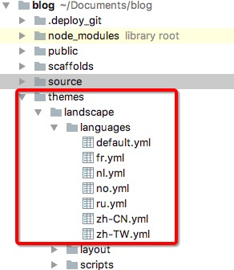

修改_config.yml
```
language: zh-CN
```



例如设置为zh-CN,Hexo就会使用到themes/landscape/languages/zh-CN.yml文件


zh-CN.yml内容如下，只要修改相应的值就好了
```
categories: 分类
search: 搜索
tags: 标签
tagcloud: 标签云
tweets: 推文
prev: 上一页
next: 下一页
comment: 留言
archive_a: 归档
archive_b: 归档：%s
page: 第 %d 页
recent_posts: 最新文章
newer: 上一篇
older: 下一篇
share: Share
powered_by: Powered by
rss_feed: RSS Feed
category: Category
tag: Tag
```

