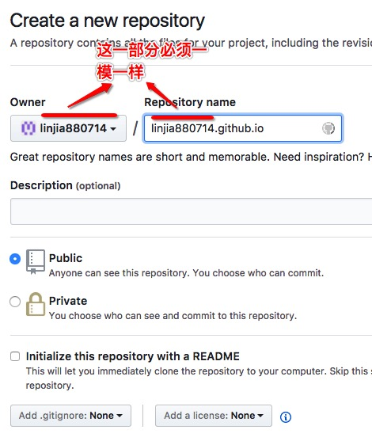
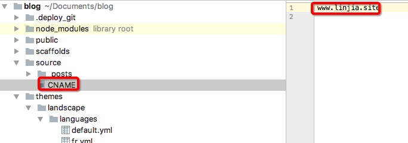
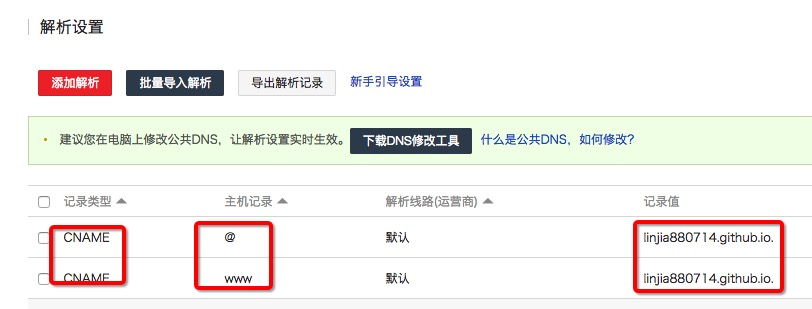

<!-- toc -->

## 1.到github.com申请账号

## 2.创建仓库

仓库名有要求的，必须是 <用户名>.github.io

## 3.配置hexo
* 安装hexo-deployer-git插件
  ```bash
  npm install hexo-deployer-git --save
  ```
* 修改_config.yaml
  ```yaml
  deploy:
    type: git
    repo: git@github.com:linjia880714/linjia880714.github.io.git
  ```
  github最好配置成ssh验证，省去了输入用户名和密码的步骤
  <font color=red>配置type: git的时候，第一次冒号和git之间少了个空格，不管如何操作配置都不生效，还是要严格的遵循语法</font>
* 发布
  ```bash
  hexo deploy
  ```
  到这里已经可以使用http://<用户名>.github.io访问了


## 4.如果需要配置自己的域名


在source目录下创建一个CNAME的文件，注意没有后缀，编辑文件写上自己的域名。然后再发布到github上

到自己的域名申请商那里解析你的域名，添加canme指定到"<用户名>.github.io."

我的是阿里云
