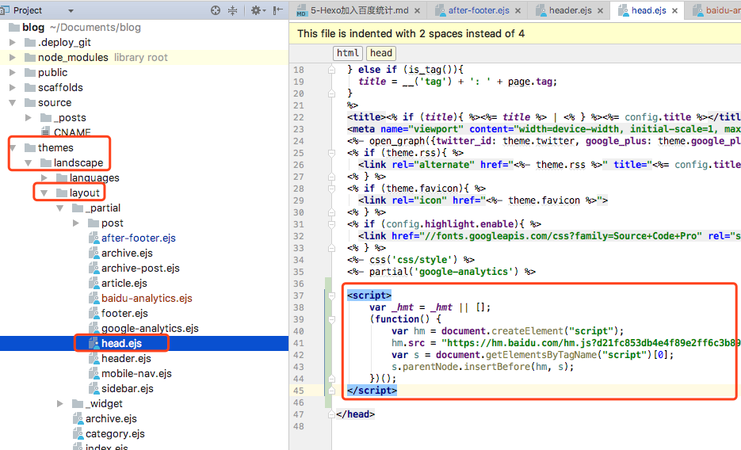
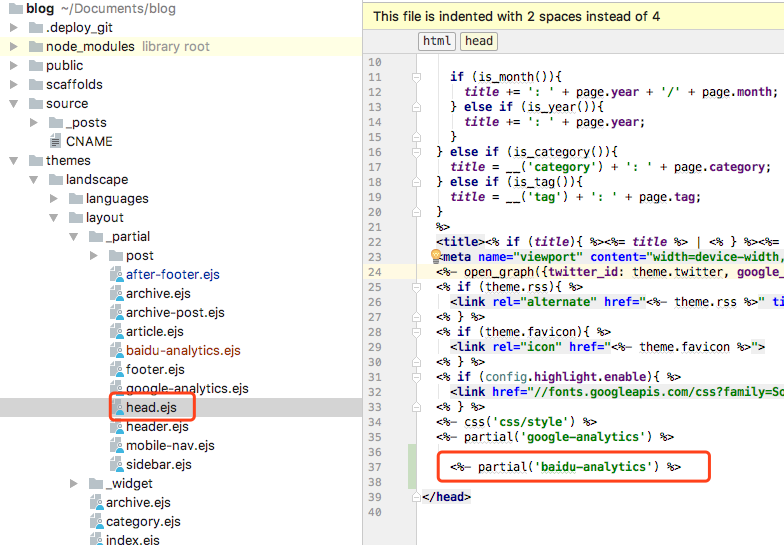

<!-- toc -->

默认主题（landscape）
把百度统计放在每个页面的最下面，百度统计的代码必须放在</head>之前

### 简单粗暴的方式
直接在themes -> landscape -> _partial -> head.ejs 文件贴上百度统计的代码



### 优雅可控的方式
1. 在themes -> landscape -> _partial 文件夹下新建文件baidu-analytics.ejs
内容如下
```
<% if (theme.baidu_analytics){ %>

<script>
    var _hmt = _hmt || [];
    (function() {
        var hm = document.createElement("script");
        hm.src = "https://hm.baidu.com/hm.js?d21fc853db4e4f89e2ff6c3b89fba31a";
        var s = document.getElementsByTagName("script")[0];
        s.parentNode.insertBefore(hm, s);
    })();
</script>

<% } %>
```
2. 在themes -> landscape -> _config.yml 添加控制字段
```
baidu_analytics: true
```
3. 在themes -> landscape -> _partial -> head.ejs 添加<%- partial('baidu-analytics') %>


