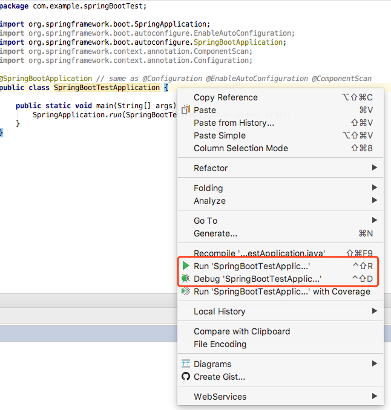

<!-- toc -->

[Spring Boot 文档](https://docs.spring.io/spring-boot/docs/current/reference/htmlsingle/)


# 1 创建项目
[https://start.spring.io/](https://start.spring.io/) 使用线上工具可以很容易创建spring-boot项目（我创建的是maven格式的项目）
Group :  com.example
Artifact : springBootTest

# 2 创建Http Server
## 2.1 修改pom.xml，加入依赖
```xml
<dependency>
    <groupId>org.springframework.boot</groupId>
    <artifactId>spring-boot-starter-web</artifactId>
</dependency>
```

## 2.2 创建Controller
创建文件 com/example/springBootTest/controller/IndexController.java
```java
package com.example.springBootTest.controller;

import com.example.springBootTest.Params;
import org.springframework.boot.SpringApplication;
import org.springframework.boot.autoconfigure.EnableAutoConfiguration;
import org.springframework.stereotype.Controller;
import org.springframework.web.bind.annotation.RequestBody;
import org.springframework.web.bind.annotation.RequestMapping;
import org.springframework.web.bind.annotation.RestController;

@RestController
public class IndexController {

    @RequestMapping("/")
    String home() {
        return "Hello World";
    }
}

```

## 2.3 运行项目
### 2.3.1 在IDE中(Eclipse,IntelliJ)
在SpringBootTestApplication右键 -> Run, localhost:8080访问


### 2.3.2 编译成jar运行
```bash
# cd到工程路径
$ ls
mvnw			pom.xml			src
mvnw.cmd		springBootTest.iml	target

# 编译打包
$ mvn clean package -Dmaven.test.skip

# 运行
$ java -jar target/springBootTest-0.0.1-SNAPSHOT.jar

# 运行(debug)
$ java -Xdebug -Xrunjdwp:server=y,transport=dt_socket,address=8000,suspend=n -jar target/springBootTest-0.0.1-SNAPSHOT.jar

```
编译打包后会生成2个jar 
springBootTest-0.0.1-SNAPSHOT.jar 集成所有依赖的jar
springBootTest-0.0.1-SNAPSHOT.jar.original 只要用户自己写的class
可以使用下面命令查看两个包的差异
```bash
#查看jar的目录结构
$ jar tvf springBootTest-0.0.1-SNAPSHOT.jar 

#解压jar包
$ jar xvf springBootTest-0.0.1-SNAPSHOT.jar 
```

### 2.3.3 使用maven运行
```bash
mvn spring-boot:run
```