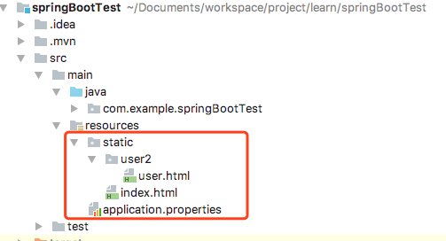
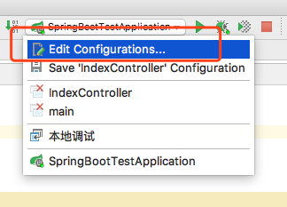
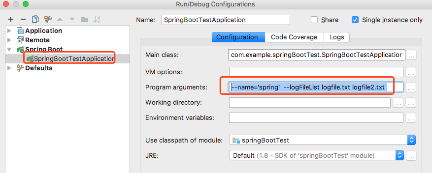

<!-- toc -->

[Spring Boot 文档](https://docs.spring.io/spring-boot/docs/current/reference/htmlsingle/)

`版本：`1.5.6.RELEASE

# 1.Rest风格的URI
访问方式 Http://host/user/100
```java
import com.example.springBootTest.bean.User;
import org.springframework.web.bind.annotation.PathVariable;
import org.springframework.web.bind.annotation.RequestMapping;
import org.springframework.web.bind.annotation.RestController;

@RestController
@RequestMapping("/user")
public class UserController {

    @RequestMapping("/{userId}")
    public User getUser(@PathVariable long userId)
    {
        User user = new User();
        user.setUserId(userId);
        return user;
    }
}
```

----

# 2.访问静态资源
在classpath路径下，有如下文件夹名称 /static (or /public or /resources or /META-INF/resources) 
里面的文件将作为静态文件被访问, 建立如下文件

Http://host/index.html
Http://host/user2/user.html
注意：为什么是user2而不是user，在上面我们建立了个Controller（UserController），如果使用user的话，优先匹配Controller，会报错

----

# 3.Spring mvc Json格式化输出配置(Jackson)
## 3.1 Jackson格式化输出Date
spring默认使用Jackson输出json，Jackson对于Date是输出成时间戳，要改成"yyyy-MM-dd hh:mm:ss"这种格式的字符串
```java
import com.fasterxml.jackson.core.JsonGenerator;
import com.fasterxml.jackson.core.JsonParser;
import com.fasterxml.jackson.core.JsonProcessingException;
import com.fasterxml.jackson.databind.DeserializationContext;
import com.fasterxml.jackson.databind.JsonDeserializer;
import com.fasterxml.jackson.databind.JsonSerializer;
import com.fasterxml.jackson.databind.SerializerProvider;
import com.fasterxml.jackson.databind.annotation.JsonDeserialize;
import org.springframework.boot.jackson.JsonComponent;

import java.io.IOException;
import java.text.SimpleDateFormat;
import java.util.Date;

/**
 * Created by jialin on 17/8/2017.
 */
@JsonComponent
public class JsonConfig {

    private static final SimpleDateFormat format = new SimpleDateFormat("yyyy-MM-dd hh:mm:ss");

    public static class Serializer extends JsonSerializer<Date> {
        public void serialize(Date value, JsonGenerator gen, SerializerProvider serializers) throws IOException, JsonProcessingException {
            gen.writeString(format.format(value));
        }
    }

    public static class Deserializer extends JsonDeserializer<Date> {
        public Date deserialize(JsonParser p, DeserializationContext ctxt) throws IOException, JsonProcessingException {
            return null;
        }
    }

}

```
----
## 3.1 Jackson不输出null或是空的变量
```java
import com.fasterxml.jackson.annotation.JsonInclude;
import com.fasterxml.jackson.databind.ObjectMapper;
import org.springframework.beans.factory.annotation.Autowired;
import org.springframework.boot.autoconfigure.jackson.Jackson2ObjectMapperBuilderCustomizer;
import org.springframework.context.annotation.Bean;
import org.springframework.http.converter.json.Jackson2ObjectMapperBuilder;
import org.springframework.stereotype.Component;

@Component
public class JsonConfig implements Jackson2ObjectMapperBuilderCustomizer{

    public void customize(Jackson2ObjectMapperBuilder jacksonObjectMapperBuilder) {
        jacksonObjectMapperBuilder.serializationInclusion(JsonInclude.Include.NON_NULL).serializationInclusion(JsonInclude.Include.NON_EMPTY);
    }
}
```

或者

```java
import com.fasterxml.jackson.annotation.JsonInclude;
import com.fasterxml.jackson.databind.ObjectMapper;
import org.springframework.boot.autoconfigure.jackson.Jackson2ObjectMapperBuilderCustomizer;
import org.springframework.context.annotation.Bean;
import org.springframework.http.converter.json.Jackson2ObjectMapperBuilder;
import org.springframework.stereotype.Component;

/**
 * Created by jialin on 22/8/2017.
 */
@Component
public class JsonConfig {

    @Bean
    public Jackson2ObjectMapperBuilder objectMapperBuilder() {
        Jackson2ObjectMapperBuilder builder = new Jackson2ObjectMapperBuilder();
        builder.serializationInclusion(JsonInclude.Include.NON_NULL).serializationInclusion(JsonInclude.Include.NON_EMPTY);
        return builder;
    }
}

```

----

# 4.获取命令行启动的参数

----

```bash
# 运行
$ java -jar target/springBootTest-0.0.1-SNAPSHOT.jar --name='spring' --logFileList logfile.txt logfile2.txt 
```

* 如何在IntelliJ IDEA配置这个参数




----

## 4.1 使用@Value
```java
import org.springframework.beans.factory.annotation.Value;
import org.springframework.stereotype.Component;
import javax.annotation.PostConstruct;

@Component
public class ParamsFromCommandLine {

    @Value("${name}")
    private String name;

    @Value("${logFileList}")
    private String logFileList;

    @PostConstruct
    public void init()
    {
        System.out.println("name = "+name);
        System.out.println("logFileList = "+logFileList);
    }
}
```
结果可以看出需要--name='spring'有等于号的才能拿到
```bash
name = 'spring'
logFileList = 
```

----

## 4.2 使用ApplicationArguments
```java
import org.springframework.beans.factory.annotation.Autowired;
import org.springframework.boot.ApplicationArguments;
import org.springframework.stereotype.Component;
import java.util.List;
import java.util.Set;

@Component
public class MyBean {

    @Autowired
    public MyBean(ApplicationArguments args) {
        boolean name = args.containsOption("name");

        // Print NonOptionArgs
        List<String> nonOptionArgs = args.getNonOptionArgs();
        if (nonOptionArgs!=null)
        {
            for (String item:nonOptionArgs)
            {
                System.out.println("nonOptionArg :" + item);
            }
        }

        // Print Names
        Set<String> names = args.getOptionNames();
        if (names != null)
        {
            for (String item:names)
            {
                System.out.println(item+" = " +args.getOptionValues(item));
            }

        }
    }
}

```
结果，值得注意的是args.getOptionValues是返回一个数据，那就是我们是否可以添加多一个"--name"
```bash
$ java -jar target/springBootTest-0.0.1-SNAPSHOT.jar --name='spring'  --logFileList logfile.txt logfile2.txt 
nonOptionArg :logfile.txt
nonOptionArg :logfile2.txt
logFileList = []
name = ['spring']

# 运行
$ java -jar target/springBootTest-0.0.1-SNAPSHOT.jar --name='spring' --name='spring2' --logFileList logfile.txt logfile2.txt 
nonOptionArg :logfile.txt
nonOptionArg :logfile2.txt
logFileList = []
name = ['spring','spring2']
```

----

## 4.3 实现CommandLineRunner接口
```java
import org.springframework.beans.factory.annotation.Value;
import org.springframework.boot.CommandLineRunner;
import org.springframework.stereotype.Component;

@Component
public class ConfigBeforeStart implements CommandLineRunner {

    public void run(String... args) {
        for (String item : args)
        {
            System.out.println("args : "+item);
        }
    }
}
```
结果
```bash
args : --name='spring'
args : --logFileList
args : logfile.txt
args : logfile2.txt
```
CommandLineRunner主要作用是用于SpringApplication启动之前执行一些代码，具体可以看[boot-features-command-line-runner](https://docs.spring.io/spring-boot/docs/current/reference/htmlsingle/#boot-features-command-line-runner)

----

# spring mvc 自定义header
```java
import com.example.springBootTest.Params;
import org.springframework.boot.SpringApplication;
import org.springframework.boot.autoconfigure.EnableAutoConfiguration;
import org.springframework.http.HttpHeaders;
import org.springframework.http.HttpStatus;
import org.springframework.http.ResponseEntity;
import org.springframework.stereotype.Controller;
import org.springframework.web.bind.annotation.ModelAttribute;
import org.springframework.web.bind.annotation.RequestBody;
import org.springframework.web.bind.annotation.RequestMapping;
import org.springframework.web.bind.annotation.RestController;
import org.springframework.web.servlet.resource.ResourceHttpRequestHandler;

import javax.servlet.http.HttpServletResponse;

@RestController
public class IndexController {

    @RequestMapping("/1")
    String home(HttpServletResponse response) {
        response.setHeader("header1","header1");
        return "Hello World 1";
    }

    @RequestMapping("/2")
    public ResponseEntity home2()
    {
        HttpHeaders httpHeaders = new HttpHeaders();
        httpHeaders.add("header2","header2");
        httpHeaders.add("header3","header3");
        return new ResponseEntity("Hello World 2",httpHeaders, HttpStatus.OK);
    }

    @ModelAttribute
    public void setVaryResponseHeader(HttpServletResponse response) {
        response.setHeader("Vary", "Accept");
    }
}
```
以上展现了3种方式
1. HttpServletResponse以参数的方式传入到方法里面
2. 通过返回ResponseEntity，设置headers
3. @ModelAttribute，这个注解的作用是Controller的每个方法执行前都会执行