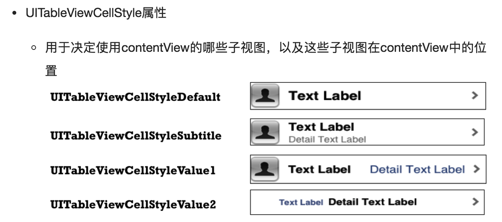

<!-- toc -->

### 默认UITableViewCell的样式


### 下拉刷新
```objc
UIRefreshControl *refresh = [[UIRefreshControl alloc]init];
refresh.attributedTitle = [[NSAttributedString alloc]initWithString:@"刷新"];
[refresh addTarget:self action:@selector(refreshAction) forControlEvents:UIControlEventValueChanged];
self.refreshControl = refresh;

-(void)refreshAction
{
    if (self.refreshControl.isRefreshing){
        self.refreshControl.attributedTitle = [[NSAttributedString alloc]initWithString:@"加载中..."];
        // do something you need
        [self.refreshControl endRefreshing];
    }
}
```

### 不允许点击
```objc
tableView.allowsSelection=NO;
```

### 滚动至某一行
```objc
[tableView scrollToRowAtIndexPath:indexPath atScrollPosition:UITableViewScrollPositionBottom animated:YES];
```

### Table view data source
```objc
- (NSInteger)numberOfSectionsInTableView:(UITableView *)tableView {
    return 1;
}

- (NSInteger)tableView:(UITableView *)tableView numberOfRowsInSection:(NSInteger)section {
    return tableViewData.count;
}

- (UITableViewCell *)tableView:(UITableView *)tableView cellForRowAtIndexPath:(NSIndexPath *)indexPath {
   
    static NSString *iden = @"xxxxx";
    UITableViewCell *cell = [self.tableView dequeueReusableCellWithIdentifier:iden];
    if (cell==nil) {
        cell=[[UITableViewCell alloc] initWithStyle:UITableViewCellStyleDefault reuseIdentifier:iden];
    }
    
    // do something
    
    return cell;
}
```