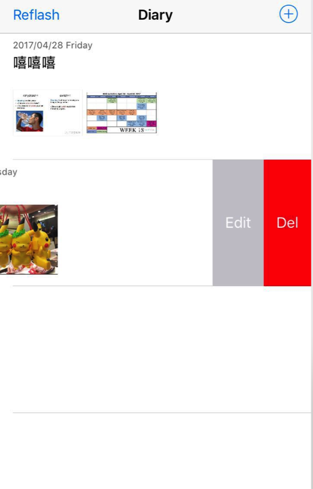

<!-- toc -->

### 左滑动显示一个按钮（系统自带）

```objc
- (BOOL)tableView:(UITableView *)tableView canEditRowAtIndexPath:(NSIndexPath *)indexPath {
    return YES;
}

- (void)tableView:(UITableView *)tableView commitEditingStyle:(UITableViewCellEditingStyle)editingStyle forRowAtIndexPath:(NSIndexPath *)indexPath {
    if (editingStyle == UITableViewCellEditingStyleDelete) {
        
    	// do something
    	// 例如删除DataSource的数据

    	// UI上删除这条记录
        [tableView deleteRowsAtIndexPaths:@[indexPath] withRowAnimation:UITableViewRowAnimationFade];

    } else if (editingStyle == UITableViewCellEditingStyleInsert) {
       	
    }   
}

- (NSString *)tableView:(UITableView *)tableView titleForDeleteConfirmationButtonForRowAtIndexPath:(NSIndexPath *)indexPath
{
	// 默认的文案是Del
	return @"删除";
}

- (UITableViewCellEditingStyle)tableView:(UITableView *)tableView editingStyleForRowAtIndexPath:(NSIndexPath *)indexPath
{
	//UITableViewCellEditingStyle有三种模式，测试只有UITableViewCellEditingStyleDelete是有效的;
	//UITableViewCellEditingStyleNone,
	//UITableViewCellEditingStyleDelete,
	//UITableViewCellEditingStyleInsert
	//没有实现这个方法，默认是UITableViewCellEditingStyleDelete
	return UITableViewCellEditingStyleDelete;
}

```

### 左滑动显示多个按钮（系统自带，IOS 8.0以上）
```objc
- (BOOL)tableView:(UITableView *)tableView canEditRowAtIndexPath:(NSIndexPath *)indexPath {
    return YES;
}

- (NSArray<UITableViewRowAction *> *)tableView:(UITableView *)tableView editActionsForRowAtIndexPath:(NSIndexPath *)indexPath
{
    UITableViewRowAction *edit = [UITableViewRowAction rowActionWithStyle:UITableViewRowActionStyleNormal title:@"Edit" handler:^(UITableViewRowAction * _Nonnull action, NSIndexPath * _Nonnull indexPath) {
        NSLog(@"edit");
    }];
    
    UITableViewRowAction *del = [UITableViewRowAction rowActionWithStyle:UITableViewRowActionStyleNormal title:@"Del" handler:^(UITableViewRowAction * _Nonnull action, NSIndexPath * _Nonnull indexPath) {
        NSLog(@"del");
        [tableView deleteRowsAtIndexPaths:@[indexPath] withRowAnimation:UITableViewRowAnimationFade];
       
    }];
    del.backgroundColor = [UIColor redColor];
    
    return [NSArray arrayWithObjects:del,edit,nil] ;
}
```

