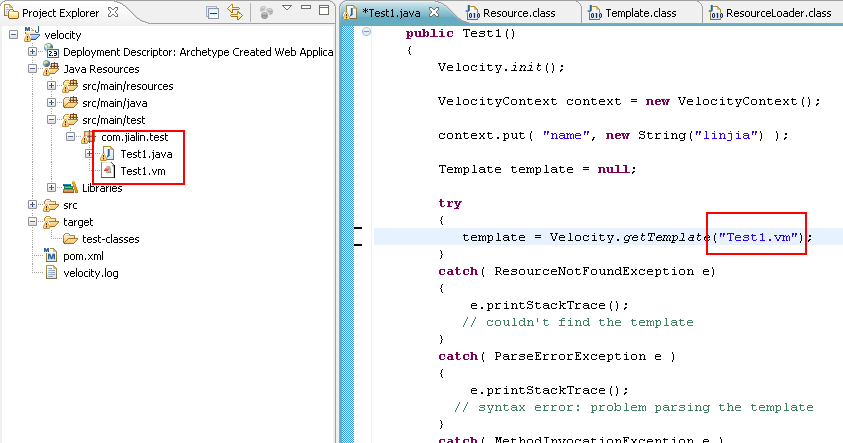
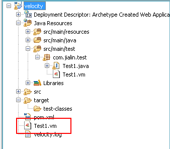

错误：org.apache.velocity.exception.ResourceNotFoundException: Unable to find resource 
死活解决不了，最后看了下源码，终于找到错误所在了

从官网copy自己稍微改下的例子


开始是天真的放在同一目录下的相对路径，结果一次又一次的Unable to find resource

最后实在受不了，追踪了下velocity的源码 org.apache.velocity.runtime.resource.loader.FileResourceLoader
```java
public boolean resourceExists(String name)  
  {  
      if (name == null)  
      {  
          return false;  
      }  
      name = StringUtils.normalizePath(name);  
      if (name == null || name.length() == 0)  
      {  
          return false;  
      }  
  
      int size = paths.size();  
      for (int i = 0; i < size; i++)  
      {  
          String path = (String)paths.get(i);  
          try  
          {  
              File file = getFile(path, name);  
              if (file.canRead())  
              {  
                  return true;  
              }  
          }  
          catch (Exception ioe)  
          {  
              String msg = "Exception while checking for template " + name;  
              log.debug(msg, ioe);  
          }  
      }  
      return false;  
  }  
```

最后是变成了"./Test1.vm"

放在这个目录就没事了。

 
“.”代表的应该是项目的根路径
 
最后试了下使用“/Test.vm”,“./Test.vm”和“Test.vm”一样