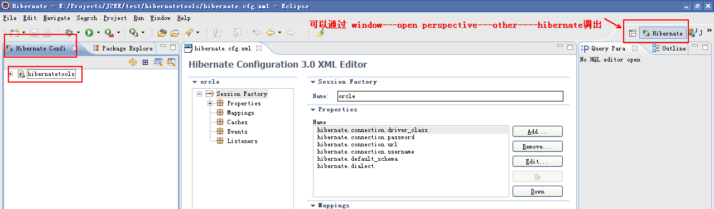

使用hibernate-tool的版本是hibernatetools-Update-2010-09-08_14-25-39-H23
1.在eclipse下安装好hibernate-tool插件，新建一个hibernate.cxf.xml文件

2.写好数据库连接配置

3

4

5

6

7

8

9

10

11

12

13

14.下图生成的entity有注释是因为使用的模板不是hibernate-tools提供的，是自己修改的

hibernate生成注释模板下载：


 
hibernate生成中文注释乱码解决（eclipse设置为utf-8编码）：
修改hibernate-tool的源码

只要把hibernate-tool的hibernate-tools.jar文件替换成上面的jar包就ok了，目前只修改了oracle的中文注释乱码