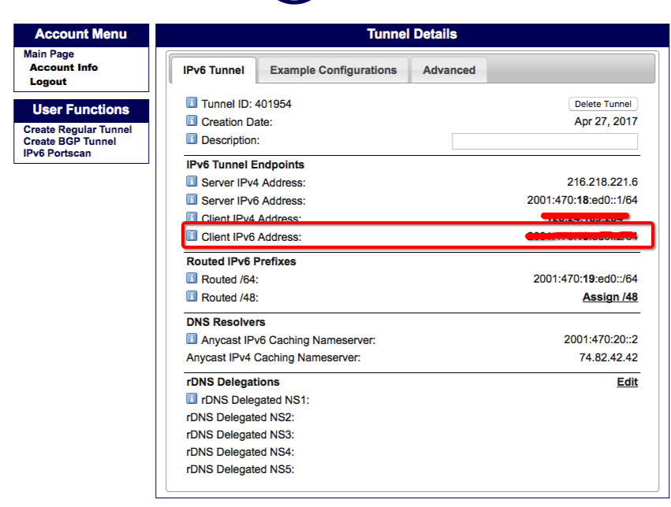
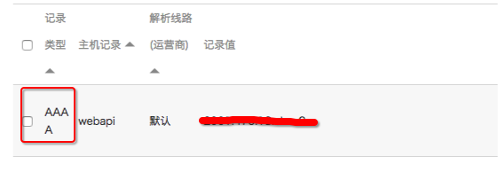
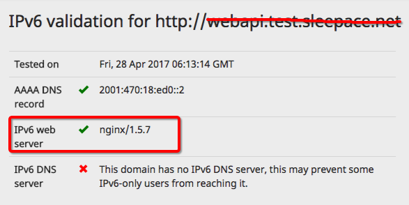

<!-- toc -->

---


### ping6 Address family not supported by protocol
```bash
[root@iZwz95xpl5hq4pfcitdtwdZ conf]# ping6 fe80::216:3eff:fe00:275e%0
socket: Address family not supported by protocol

### 那是因为机器不支持IPV6,操作完下面步骤就可以了
```

---

### 阿里云CentOS添加ipv6

#### 1.修改前备份下
cp /etc/modprobe.d/disable_ipv6.conf /data/backup/disable_ipv6.conf
cp /etc/sysconfig/network /data/backup/network

#### 2.修改isable_ipv6.conf 
vim /etc/modprobe.d/disable_ipv6.conf 

```bash
alias net-pf-10 off
options ipv6 disable=1
```
改成
```bash
#alias net-pf-10 off
options ipv6 disable=0
```

#### 3.修改network
vim /etc/sysconfig/network
```bash
NETWORKING=yes
HOSTNAME=iZwz95xpl5hq4pfcitdtwdZ
NETWORKING_IPV6=no
PEERNTP=no
GATEWAY=172.18.175.253
```
改成
```bash
NETWORKING=yes
HOSTNAME=iZwz95xpl5hq4pfcitdtwdZ
NETWORKING_IPV6=yes
PEERNTP=no
GATEWAY=172.18.175.253
```

#### 4.重启服务器

#### 5.查看是否开启
```bash
[root@iZ944o1lko3Z ~]# ifconfig | grep -i inet6
          inet6 addr: fe80::216:3eff:fe00:1f11/64 Scope:Link
          inet6 addr: fe80::216:3eff:fe00:275e/64 Scope:Link
          inet6 addr: 2001:470:18:ed0::2/64 Scope:Global
          inet6 addr: fe80::7818:a9cc/128 Scope:Link
          inet6 addr: ::1/128 Scope:Host
```

---

### ping6 Invalid argument
```bash
[root@iZ944o1lko3Z ~]# ping6  fe80::216:3eff:fe00:275e
connect: Invalid argument

### 改成下面这个就好了
[root@iZ944o1lko3Z ~]# ping6 -I eth0 ffe80::216:3eff:fe00:275e
```

---

### 阿里云centos添加ipv6隧道
参考[阿里云centos添加ipv6隧道](http://coolnull.com/4476.html)

---

### 配置AAAA解析
在[https://www.tunnelbroker.net/](https://www.tunnelbroker.net/)申请的ipv6隧道

在阿里云解析添加一条AAAA的解析记录，地址就是上图的ipv6地址。可以和A记录并存


### 测试
[http://ipv6-test.com](http://ipv6-test.com/validate.php)


### 其他
```bash
#查看某个域名的ipv6地址
host -t AAAA webapi.test.sleepace.net
```

