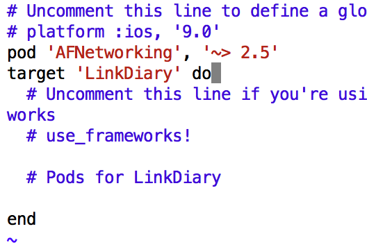

<!-- toc -->

### 安装 cocoapods
```bash
sudo gem install cocoapods
```

在中国有可能source不可用，所以更要gem的source，参考[https://gems.ruby-china.org/](https://gems.ruby-china.org/)


### 使用 pod
* 进入到项目的路径
* 初始化
  ```bash
  pod init
  ```
* 编辑Podfile文件
  添加 "pod 'AFNetworking', '~> 2.5'"
  
  
* 安装
  ```bash
  pod install
  ```
  
AFNetworking框架就安装上了