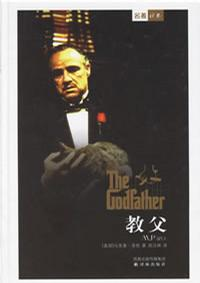

_开始：2017-04-10_
_结束：_

"友谊就是一切。比天赋更重要，比政府更重要。和家人差不多同样重要" 唐.柯里昂

"知道极地探险家在通往北极的路上要沿途存放口粮，防止日后某天会需要食物吗？那就是我父亲的人情。他迟早会找上门，而他们最好按他说的做" 迈克尔.柯里昂

我最常说的一句话是"不是什么人都可以得到我的友谊"，所以我认可的朋友真的很少，很多时候不是别人不够出色，而是自己把自己锁起来了，不愿去深入接触别人。我大概就是这样子的吧，和我相处很容易，但是能够深入我内心的寥寥无几。