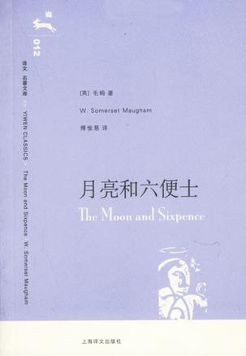

* The Moon and Sixpence（月亮与六便士）
According to a 1956 letter from Maugham, "If you look on the ground in search of a sixpence, you don't look up, and so miss the moon."

抛弃所有，家庭，工作，稳定的生活，而去追寻艺术之路。只是因为想，这种看起来难以理解的东西往往才是最坚定的。

我看到了心中的月亮，追寻虚无缥缈的，可能一生都无法触及的月亮，还是地上的六便士来得实际？如果没有了梦想，人存在于世又有什么意义呢？

