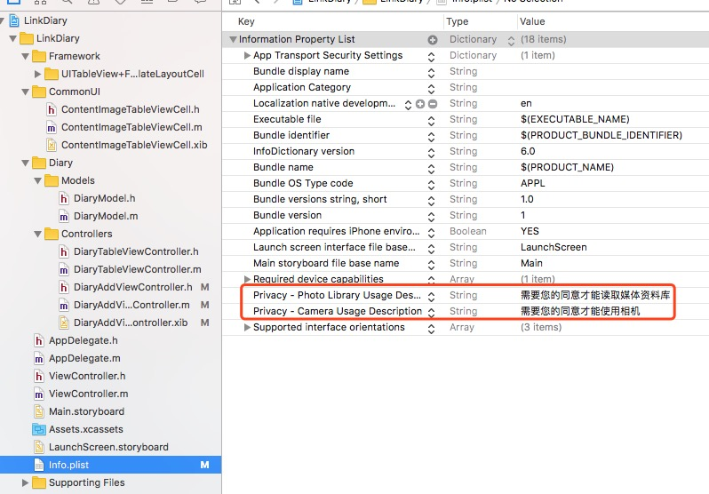

#### iOS 6.0 and later需要在info.plist添加两个key
NSPhotoLibraryUsageDescription
NSCameraUsageDescription




#### 继承UIImagePickerController的delegate
```objc
@interface DiaryAddViewController : UIViewController<UIImagePickerControllerDelegate,UINavigationControllerDelegate>

@end
```


#### 具体实现代码
```objc
@interface DiaryAddViewController ()
{
    UIImagePickerController *imagePickerController;
}
@end

@implementation DiaryAddViewController

- (void)viewDidLoad {
    [super viewDidLoad];
    
    // imagePickerController init
    imagePickerController = [[UIImagePickerController alloc] init];
    imagePickerController.delegate = self;
    imagePickerController.modalTransitionStyle = UIModalTransitionStyleFlipHorizontal;
    imagePickerController.allowsEditing = YES;
    
    // 添加sheet
    UIAlertController* alert = [UIAlertController alertControllerWithTitle:nil
                                                                   message:nil
                                                            preferredStyle:UIAlertControllerStyleActionSheet];
    
    UIAlertAction* albumAction = [UIAlertAction actionWithTitle:@"From Album" style:UIAlertActionStyleDefault
                                                        handler:^(UIAlertAction * action) {
                                                            imagePickerController.sourceType = UIImagePickerControllerSourceTypePhotoLibrary;
                                                            [self presentViewController:imagePickerController animated:YES completion:nil];
                                                            
                                                        }];
    UIAlertAction* cameraAction = [UIAlertAction actionWithTitle:@"From Camera" style:UIAlertActionStyleDefault
                                                         handler:^(UIAlertAction * action) {
                                                             imagePickerController.sourceType = UIImagePickerControllerSourceTypeCamera;
                                                             [self presentViewController:imagePickerController animated:YES completion:nil];
                                                         }];
    UIAlertAction* defaultAction = [UIAlertAction actionWithTitle:@"Cancel" style:UIAlertActionStyleDefault
                                                          handler:^(UIAlertAction * action) {}];
    [alert addAction:albumAction];
    [alert addAction:cameraAction];
    [alert addAction:defaultAction];
    [self presentViewController:alert animated:YES completion:nil];

}

- (void)imagePickerController:(UIImagePickerController *)picker didFinishPickingMediaWithInfo:(NSDictionary<NSString *,id> *)info
{
    //info里面有5个值
    //UIImagePickerControllerCropRect 裁剪尺寸
    //UIImagePickerControllerEditedImage 编辑之后的图片
    //UIImagePickerControllerMediaType 资源类型，图片或是视频
    //UIImagePickerControllerOriginalImage 原始图片
    //UIImagePickerControllerReferenceURL 原始文件的URL

    NSString *mediaType=[info objectForKey:UIImagePickerControllerMediaType];
    //判断资源类型
    if ([mediaType isEqualToString:@"public.image"]){
        
        UIImage *image = [info objectForKey:UIImagePickerControllerEditedImage];
        
        UIImageView *imageView = [[UIImageView alloc]initWithImage:image];
        
        // do something
    }
    
    // 一定要调用这个方法，不然会一直停留在图片选择页面
    [self dismissViewControllerAnimated:YES completion:^(){}];
}

@end


```